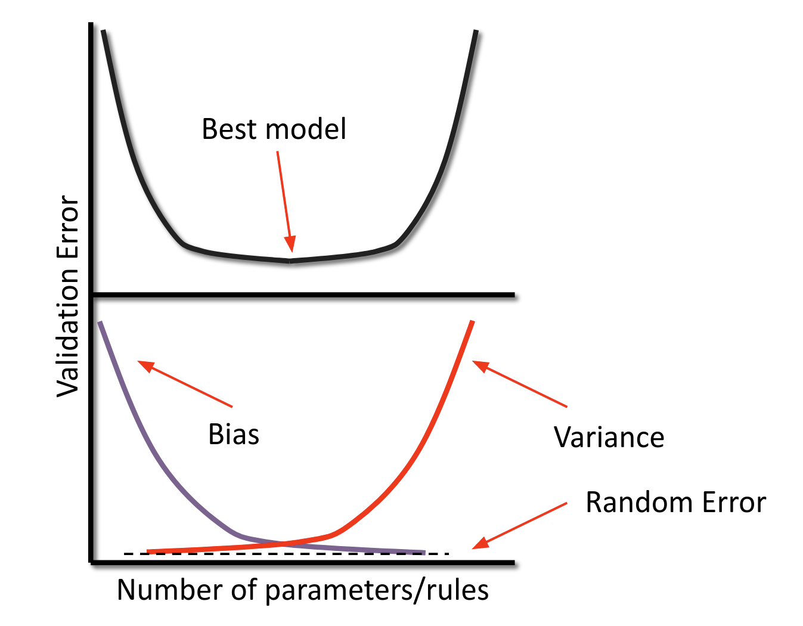

## GWU_DNSC 6314 & 6315: Course Outline

Materials for an introduction to machine learning.

* Lecture 1: Preliminaries, Feature Engineering and Feature Selection
* Lecture 2: Contemporary Linear Model Approaches
* Lecture 3: Model Assessment and Selection
* Lecture 4: Decision Trees
* Lecture 5: Artificial Neural Networks
* Lecture 6: Other Estimators: Support Vector Machines (SVM) k-Nearest-Neighbors (*k*NN), etc.
* Lecture 7: Decision Tree Ensembles
* Lecture 8: Convolutional Neural Networks
* Lecture 9: Clustering
* Lecture 10: Dimension Reduction
* Lecture 11: Association Rules and Recommendation
* Lecture 12: Deployment

Corrections or suggestions? Please file a [GitHub issue](https://github.com/jphall663/GWU_ML/issues/new).

***

## Preliminary Resources

* [Basic Data Manipulation](resource/basic_data_prep.md)
* [Primer on Technical Malpractice](https://docs.google.com/presentation/d/1cZeaoIp4cQsVY_gj2a5Pg7ygexepQZRS-ZEn6n2QqEU/edit?usp=sharing)
* Syllabi:
  * [DNSC 6314](https://docs.google.com/document/d/1YORCBhsOqNT5pY7ltzigtaf4EuawgKyu0_Be0QiiVbg/edit?usp=sharing)
  * [DNSC 6315](https://docs.google.com/document/d/1JccZWRz6dtXcvOMmRzJR-MwjLJNly1q24pWS90ti9jk/edit?usp=sharing)
* [Whiteboard Notation](https://docs.google.com/presentation/d/1Axf9dizaE3XvGRelBHfsnAlMUPFuMExQ2WNVwQBKMrw/edit?usp=sharing)

## Lecture 1: Preliminaries, Feature Engineering and Feature Selection

**Source:** [Lecture 1 feature extraction example](https://drive.google.com/file/d/1e_-015Zfx5sRdWXPR_6qFAC70rJuxFup/view?usp=sharing).

### Lecture 1 Class Materials

* [Lecture Notes](https://docs.google.com/presentation/d/1NkTZyspUaQ2CwDv_5yGE_7fwdrUsmUAy93rj_eFppK4/edit?usp=sharing)
* [Lecture 1 Feature Engineering Table](resource/feature_engeering.md)
* [Assignment 1](https://docs.google.com/document/d/1c_WOQMFyPMEiVgHXqyn9-pt7c1Kncl0wBbzCnvycc00/edit?usp=sharing)
* **Software Examples**:
  * [Feature selection](https://drive.google.com/file/d/1goBhzXLqjagd8EDyvQwgAtOYBIykIIr_/view?usp=sharing)
  * [Feature extraction](https://drive.google.com/file/d/1e_-015Zfx5sRdWXPR_6qFAC70rJuxFup/view?usp=sharing)
  * [Over- and under-sampling](https://drive.google.com/file/d/1fhat_dZhhqjAtPs2IJ5USA9wTVP5dJ2e/view?usp=sharing)
  * [Simple Encoding](https://drive.google.com/file/d/16anwAZt38Sr8j7Tl1gSSjBgV_e5bs8HA/view?usp=sharing)
  * [Target Encoding (Categorical)](https://drive.google.com/file/d/1HgBWhmryQwHtReaweoZdlJGMwtdqtu_M/view?usp=sharing)
  * [Target Encoding (Numeric)](https://drive.google.com/file/d/1Dg0YP1tgFs_ILMTLN6NywX-MP7vEOYPF/view?usp=sharing)
  * [Discretization](https://drive.google.com/file/d/1jSq65mivctrmu91rps3GoggLwoHoUM5P/view?usp=sharing)
  * [Winsorizing](https://drive.google.com/file/d/1SmGe_k1s0aRrzvP6mb4a7k8lbXoWEJg2/view?usp=sharing)
  * [Imputation](https://drive.google.com/file/d/1F57RnBa7x9fm_K9eEOaYEJqmyjrwA_Jq/view?usp=sharing)
  * [Standardization](https://drive.google.com/file/d/16uBhnFgU3NLO_hcAAGhF1e9TcsFq1lIe/view?usp=sharing)

All notebooks also available in the [`notebook`](notebook/lecture_1) folder.

### Lecture 1 Reading

* [*Label, Segment, Featurize: a cross domain framework for prediction engineering*](https://dai.lids.mit.edu/wp-content/uploads/2016/08/07796929.pdf)
* *Introduction to Data Mining* - Sections 2.2-2.3 ([Chapter 2 notes](https://www-users.cs.umn.edu/~kumar/dmbook/dmslides/chap2_data.pdf))
* [*Introduction to the Foundations of Causal Discovery*](https://www.its.caltech.edu/~fehardt/papers/Eberhardt_IJDSA2017.pdf) - Sections 1-4, and 7

### Lecture 1 Links
* [LiNGAM for causal discovery](https://sites.google.com/view/sshimizu06/lingam)
* [Causal Discovery Toolbox](https://github.com/FenTechSolutions/CausalDiscoveryToolbox)
* [pandas-profiling](https://github.com/pandas-profiling/pandas-profiling)

## Lecture 2: Contemporary Linear Model Approaches

**Source:** [From GLM to GBM: Building the Case For Complexity](https://nbviewer.org/github/jphall663/interpretable_machine_learning_with_python/blob/master/glm_mgbm_gbm.ipynb).

### Lecture 2 Class Materials

* [Lecture Notes](https://docs.google.com/presentation/d/1a24nLOHOxEwS7GdNfvJAptb9ZD0Rmq_8lyXHJLb4deQ/edit?usp=sharing)
* [Lecture 2 Software Example](https://drive.google.com/file/d/1eNJzS2J_LPhGxgg3JbxbvlD4DEDByFSO/view?usp=sharing)
* [Assignment 2](https://docs.google.com/document/d/1lbWXiAMdtCCeb-AQ9Xa3JD2xmcqZ-C2lXWiP1RexDfo/edit?usp=sharing)
  * [Assignment 2 Notebook](https://colab.research.google.com/drive/1MKGYhPuLaAN_4RriqOAmacsm7qpaQF1N?usp=sharing)
  * [Assignment 2 Data](https://raw.githubusercontent.com/jphall663/GWU_ML/main/data/lecture_2/loan_clean.csv)

[`Notebooks`](https://github.com/jphall663/GWU_ML/tree/main/notebook/lecture_2) and [`data`](https://raw.githubusercontent.com/jphall663/GWU_ML/main/data/lecture_2/loan_clean.csv) also available via GitHub.

### Lecture 2 Reading
* [_Elements of Statistical Learning_](https://hastie.su.domains/Papers/ESLII.pdf):
  * Sections 3.1 - 3.4
  * Section 4.4
* [_Regularization and variable selection via the elastic net_](https://hastie.su.domains/Papers/B67.2%20(2005)%20301-320%20Zou%20&%20Hastie.pdf)

### Lecture 2 Links

* [h2o](https://h2o-release.s3.amazonaws.com/h2o/rel-zorn/1/index.html) (Python or R download, requires Java) 
* [Generalized Linear Model (GLM) documentation](https://docs.h2o.ai/h2o/latest-stable/h2o-docs/data-science/glm.html)
* [Generalized Linear Modeling with H2O](https://docs.h2o.ai/h2o/latest-stable/h2o-docs/booklets/GLMBooklet.pdf)
* [elasticnet](https://cran.r-project.org/web/packages/elasticnet/index.html) (R)
* [glmnet](https://cran.r-project.org/web/packages/glmnet/index.html) (R)

## Lecture 3: Model Assessment and Selection

**Source:** [From Lecture 3](https://docs.google.com/presentation/d/1ueIPK1mb0etN_gUNffwjBszrPlOhfUbVItzn8Fil4LI/edit?usp=sharing).

### Lecture 3 Class Materials

* [Lecture Notes](https://docs.google.com/presentation/d/1ueIPK1mb0etN_gUNffwjBszrPlOhfUbVItzn8Fil4LI/edit?usp=sharing)
* [Lecture 3 Software Example](https://drive.google.com/file/d/1t_5IBiyGIC6XG1H0-qtja1fBvmY4Y7R8/view?usp=sharing)
* [Assignment 3](https://docs.google.com/document/d/1zqZB16tryMxZV1iFxI8SbD6k5pQhjteEpsU9GYGrIJo/edit?usp=sharing)
  * [Assignment 3 Notebook](https://colab.research.google.com/drive/1w5kHE2aMFcACXgaVPu1488kvjwbX_B1R?usp=sharing)
  * [Assignment 3 Data](https://raw.githubusercontent.com/jphall663/GWU_ML/main/data/lecture_2/loan_clean.csv)

[`Notebooks`](https://github.com/jphall663/GWU_ML/tree/main/notebook/lecture_3) and [`data`](https://github.com/jphall663/GWU_ML/tree/main/data/lecture_3) also available via GitHub.

### Lecture 3 Reading
* [_Elements of Statistical Learning_](https://hastie.su.domains/Papers/ESLII.pdf):
  * Sections 7.1 - 7.5
  * Section 7.10

* [_Introduction to Data Mining_](https://www-users.cse.umn.edu/~kumar001/dmbook/ch3_classification.pdf):
  * Sections 3.4 - 3.6
  
* [_KDD-Cup 2004: Results and Analysis_](https://www.cs.cornell.edu/people/tj/publications/caruana_etal_04a.pdf)

## Lecture 4: Decision Trees

**Source:** [_Machine Learning for High-Risk Applications_](https://www.oreilly.com/library/view/machine-learning-for/9781098102425/).

### Lecture 4 Class Materials

* [Lecture Notes](https://docs.google.com/presentation/d/1UseNXdXEhH6ydg_bhwT4zdkGxlQaVZSCw9q_kHINrTw/edit?usp=sharing)
* [Lecture 4 Software Example](https://colab.research.google.com/drive/1zNP9XWQKb-YtvDWyAB5600fjoZdYT_pX?usp=sharing)
* [Assignment 4](https://docs.google.com/document/d/1skSDS6QzTI1TfWeprj76lannNFQ67a8ofakseW-mQZw/edit?usp=sharing)
  * [Assignment 4 Notebook](https://colab.research.google.com/drive/1UQcbWYywn-ViH92WB7FeawGj_MenE_jX?usp=sharing)
  * [Assignment 4 Data](https://raw.githubusercontent.com/jphall663/GWU_ML/main/data/lecture_2/loan_clean.csv)

[`Notebooks`](https://github.com/jphall663/GWU_ML/tree/main/notebook/lecture_4) and [`data`](https://github.com/jphall663/GWU_ML/tree/main/data/lecture_4) also available via GitHub.

### Lecture 4 Reading
* [_Introduction to Data Mining_](https://www-users.cse.umn.edu/~kumar001/dmbook/ch3_classification.pdf):
  * Sections 3.1 - 3.3

* [_Elements of Statistical Learning_](https://hastie.su.domains/Papers/ESLII.pdf):
  * Section 9.2

## Lecture 5: Artificial Neural Networks

**Source:** _Demystifying Deep Learning_, SAS Institute.

### Lecture 5 Class Materials

* [Lecture Notes](https://docs.google.com/presentation/d/1GiaOSjNhYeRIQPC0OKPFzyk32NAOCWo39-X8McicUn8/edit?usp=sharing)
* [Lecture 5 Software Example](https://colab.research.google.com/drive/1ipCtbfqlhgU3hPN2JLmZzZ6MbG7BsHMk?usp=sharing)
* [Assignment 5](https://docs.google.com/document/d/1seUAfi8XKfhSr2KL3j3-k2c32jid41WXhhTRWlp2BbQ/edit?usp=sharing)
  * [Assignment 5 Notebook](https://drive.google.com/file/d/1xP_iwnn4holL0dZuZeWMQn1M2Rtlz6-R/view?usp=sharing)
  * [Assignment 5 Data](https://raw.githubusercontent.com/jphall663/GWU_ML/main/data/lecture_2/loan_clean.csv)

[`Notebooks`](https://github.com/jphall663/GWU_ML/tree/main/notebook/lecture_5) and [`data`](https://github.com/jphall663/GWU_ML/tree/main/data/lecture_5) also available via GitHub.

### Lecture 5 Reading
* [_Introduction to Data Mining_](https://www-users.cse.umn.edu/~kumar001/dmbook/index.php):
  * Section 4.7

* [_Elements of Statistical Learning_](https://hastie.su.domains/Papers/ESLII.pdf):
  * Sections 11.3 - 11.7

### Lecture 5 Links
* [Neural Network Zoo](https://www.asimovinstitute.org/neural-network-zoo/)
* [_Deep Learning with H2O_](https://docs.h2o.ai/h2o/latest-stable/h2o-docs/booklets/DeepLearningBooklet.pdf)
* [_Neural Additive Models: Interpretable Machine Learning with Neural Nets_](https://arxiv.org/pdf/2004.13912.pdf) (How I would recommend training an ANN for structured data.)
* [THE MNIST DATABASE](http://yann.lecun.com/exdb/mnist/) 

## Lecture 6: Support Vector Machines and k-Nearest-Neighbors

**Source:** [From Assignment 6](https://docs.google.com/document/d/1JpcJUUu4GGntacXc6JV2_PrAsgEaec2jDvEDRoZKlsg/edit?usp=sharing).

### Lecture 6 Class Materials

* [Lecture Notes](https://docs.google.com/presentation/d/1x-jCH8b-93kJ0-z2RXya-ru0S5B-6DpEJbfAT1CHJhc/edit?usp=sharing)
* [Lecture 6 Software Example](https://colab.research.google.com/drive/1n3zchLiWRcwpHT4bWtJmAnsmEXJRt2kI?usp=sharing)
* [Assignment 6](https://docs.google.com/document/d/1JpcJUUu4GGntacXc6JV2_PrAsgEaec2jDvEDRoZKlsg/edit?usp=sharing)

[`Notebooks`](https://github.com/jphall663/GWU_ML/tree/main/notebook/lecture_6) and [`data`](https://github.com/jphall663/GWU_ML/tree/main/data/lecture_6) also available via GitHub.

### Lecture 6 Reading
* [_Introduction to Data Mining_](https://www-users.cse.umn.edu/~kumar001/dmbook/index.php):
  * Section 4.9

* [_Elements of Statistical Learning_](https://hastie.su.domains/Papers/ESLII.pdf):
  * Sections 12.1 - 12.3

## Lecture 7: Decision Tree Ensembles

**Source:** [From Lecture 7](https://docs.google.com/presentation/d/1GoQH-aVb8gG-VYFLkGIcrhSo-OM7ADM_qHyUHXZ8a6M/edit?usp=sharing).

### Lecture 7 Class Materials

* [Lecture Notes](https://docs.google.com/presentation/d/1GoQH-aVb8gG-VYFLkGIcrhSo-OM7ADM_qHyUHXZ8a6M/edit?usp=sharing)
* [Lecture 7 Software Example](https://colab.research.google.com/drive/1S2agRyCGtv-HSJdnFtMQ3FKfvOXQ2Zua?usp=sharing)
* [Assignment 7](https://docs.google.com/document/d/1AybsLdUiNGxGNZ3FDLVxOqHbVFCoC9i9Vs6kdjkwacU/edit?usp=sharing)
  * [Assignment 7 Notebook](https://drive.google.com/file/d/1jXRPQGe38dKDdbpU5imTrojpCZxEXBXH/view?usp=sharing)
  * [Assignment 7 Data](https://raw.githubusercontent.com/jphall663/GWU_ML/main/data/lecture_2/loan_clean.csv)

[`Notebooks`](https://github.com/jphall663/GWU_ML/tree/main/notebook/lecture_7) and [`data`](https://github.com/jphall663/GWU_ML/tree/main/data/lecture_7) also available via GitHub.

### Lecture 7 Reading
* [_Introduction to Data Mining_](https://www-users.cse.umn.edu/~kumar001/dmbook/index.php):
  * Section 4.10

* [_Elements of Statistical Learning_](https://hastie.su.domains/Papers/ESLII.pdf):
  * Chapter 10
  * Chapter 15

### Lecture 7 Links
* [_Random Forests_](https://link.springer.com/content/pdf/10.1023/A:1010933404324.pdf)
* [_Greedy Function Approximation: A Gradient Boosting Machine_](https://jerryfriedman.su.domains/ftp/trebst.pdf)
* [_Gradient Boosting Machine With H2o_](https://docs.h2o.ai/h2o/latest-stable/h2o-docs/booklets/GBMBooklet.pdf)

## Lecture 8: Convolutional Neural Networks

**Source:** [From Lecture 8](https://docs.google.com/presentation/d/11ZpVljuGEMJsl3Jo_ENM9H8zlBpJehIx7y5w_Dx-E1Y/edit?usp=sharing), with thanks to Wen Phan.

### Lecture 8 Class Materials

* [Lecture Notes](https://docs.google.com/presentation/d/11ZpVljuGEMJsl3Jo_ENM9H8zlBpJehIx7y5w_Dx-E1Y/edit?usp=sharing)
* [Assignment 8](https://docs.google.com/document/d/1ioNjx6NOzNZmWRcJ1AD5SmzBKfwy8Jpg7zFVEvrcgEU/edit?usp=sharing)
  * [Assignment 8 Notebook](https://drive.google.com/file/d/1I-PVLAA3oo9M1Luw0fdMKx9ZMzljNMIe/view?usp=sharing)

[`Notebooks`](https://github.com/jphall663/GWU_ML/tree/main/notebook/lecture_8) are also available via GitHub.

### Lecture 8 Reading
* [_Introduction to Data Mining_](https://www-users.cse.umn.edu/~kumar001/dmbook/index.php):
  * Section 4.8

* [_Deep Learning_](https://www.deeplearningbook.org/):
  * [Chapter 9](https://www.deeplearningbook.org/contents/convnets.html)

### Lecture 8 Links
* [Keras](https://keras.io/)

## Lecture 9: Clustering

**Source:** [From Assignment 9 Notebook](https://drive.google.com/file/d/1szaSrs-lBG9P00sy1FiI4PQGGXxdNR4Z/view?usp=sharing).

### Lecture 9 Class Materials

* [Lecture Notes](https://docs.google.com/presentation/d/14pHCJmiXrPdlRantWWwO32LLvVmV_gDrwRvNLB60j0Q/edit?usp=sharing)
* [Assignment 9](https://docs.google.com/document/d/1l3iWtTxdL-EGfNRxUjRBdl7Di3erFcsWyVdm9-RuAnk/edit?usp=sharing)
  * [Assignment 9 Notebook](https://drive.google.com/file/d/1szaSrs-lBG9P00sy1FiI4PQGGXxdNR4Z/view?usp=sharing)

[`Notebooks`](https://github.com/jphall663/GWU_ML/tree/main/notebook/lecture_9) and [`data`](https://github.com/jphall663/GWU_ML/tree/main/data/lecture_2) are also available via GitHub.

### Lecture 9 Reading
* _Introduction to Data Mining_:
  * [Chapter 7](https://www-users.cs.umn.edu/~kumar001/dmbook/ch7_clustering.pdf), through Section 7.3

* [_Elements of Statistical Learning_](https://hastie.su.domains/Papers/ESLII.pdf):
  * Section 14.3

## Lecture 10: Dimension Reduction

**Source:** [From Lecture 10 Code Example](https://colab.research.google.com/drive/1l6AP8v1FPUdYbYqNI1f6z2l3Dx6l2cyK?usp=sharing).

### Lecture 10 Class Materials

* [Lecture Notes](https://docs.google.com/presentation/d/1gmdp6Sxts6g-KGKGUHb8Z_nkVHmDZNIcoiz9HYia1j8/edit?usp=sharing)
* [Lecture 10 Software Example](https://colab.research.google.com/drive/1l6AP8v1FPUdYbYqNI1f6z2l3Dx6l2cyK?usp=sharing)
* [Assignment 10](https://docs.google.com/document/d/1x11BK2GgVrAK2kxtW4ZwhQeGvf-QvMyZ6eAoKWr4TsI/edit?usp=sharing)
  * [Assignment 10 Notebook](https://colab.research.google.com/drive/1J0nCDJGoZjNwsTvArlTGdtjN-XiNw4Dc?usp=sharing)
  * [Assignment 10 Data](https://raw.githubusercontent.com/jphall663/GWU_ML/main/data/lecture_10/train.csv)

[`Notebooks`](https://github.com/jphall663/GWU_ML/tree/main/notebook/lecture_10) and [`data`](https://github.com/jphall663/GWU_ML/tree/main/data/lecture_10) are also available via GitHub.

### Lecture 10 Reading
* [_Elements of Statistical Learning_](https://hastie.su.domains/Papers/ESLII.pdf):
  * Section 14.5 - 14.6
* [_Generalized Low Rank Models_](https://people.orie.cornell.edu/mru8/doc/udell14_glrm_short.pdf)
* [_Near Optimal Signal Recovery From Random Projections: Universal Encoding Strategies?_](https://arxiv.org/pdf/math/0410542.pdf)

## Lecture 11: Association Rules and Recommendation

### Lecture 11 Class Materials

* [Lecture Notes](https://docs.google.com/presentation/d/1_wjHDs9vaTcuTPRGlLXoGp1zAJg3Mi-IOB5-oMEcc7o/edit?usp=sharing)
* [Assignment 11](https://docs.google.com/document/d/1RovJlaHXE55bITzEUYYTAG1Use9BIgeKARyYuoHW6yU/edit?usp=sharing)
  * [Assignment 11 Notebook](https://colab.research.google.com/drive/1_HQhhJVoNO8z8OUy8dT01o6WvNbJC_Ci?usp=sharing)
  * [Assignment 11 Data](https://github.com/jphall663/GWU_ML/tree/main/data/lecture_11)

[`Notebooks`](https://github.com/jphall663/GWU_ML/tree/main/notebook/lecture_11) and [`data`](https://github.com/jphall663/GWU_ML/tree/main/data/lecture_11) are also available via GitHub.

### Lecture 11 Reading

* _Introduction to Data Mining_, [Chapter 5](https://www-users.cse.umn.edu/~kumar001/dmbook/ch5_association_analysis.pdf)
  * Sections 5.1 – 5.3, and 5.7

* [_Elements of Statistical Learning_](https://hastie.su.domains/Papers/ESLII.pdf):
  * Section 14.5 - 14.6

* [_Introduction to Recommender Systems Handbook_](http://www.inf.unibz.it/~ricci/papers/intro-rec-sys-handbook.pdf)

## Lecture 12: Deployment

**Source:** [From Lecture 12](https://docs.google.com/presentation/d/1Tr_sg1XlV8FBAC1EyyPcnF3EWm-UXxhhVMaQSr_cptE/edit?usp=sharing).

### Lecture 12 Class Materials

* [Lecture Notes](https://docs.google.com/presentation/d/1Tr_sg1XlV8FBAC1EyyPcnF3EWm-UXxhhVMaQSr_cptE/edit?usp=sharing)
* [Assignment 12](https://docs.google.com/document/d/16uaO4CSOCqVTX9PqzUNTUwRgQpb2Lzikpd7tixVso6U/edit?usp=sharing)
  * [Assignment 12 Notebook](https://colab.research.google.com/drive/1Y7FX4TPBACzk_tpoBeVdUJG0IzuXvdqq?usp=sharing)
  * [Assignment 12 Data](https://raw.githubusercontent.com/jphall663/GWU_ML/main/data/lecture_2/loan_clean.csv)

[`Notebooks`](https://github.com/jphall663/GWU_ML/tree/main/notebook/lecture_12) and [`data`](https://github.com/jphall663/GWU_ML/tree/main/data/lecture_2) are also available via GitHub.

### Lecture 12 Reading

* [_How to Deploy Machine Learning Models_](https://christophergs.com/machine%20learning/2019/03/17/how-to-deploy-machine-learning-models/)
* [_Machine Learning: The High-Interest Credit Card of Technical Debt_](https://storage.googleapis.com/pub-tools-public-publication-data/pdf/43146.pdf)
* [_SUPERVISORY GUIDANCE ON MODEL RISK MANAGEMENT_](https://www.federalreserve.gov/supervisionreg/srletters/sr1107a1.pdf)

